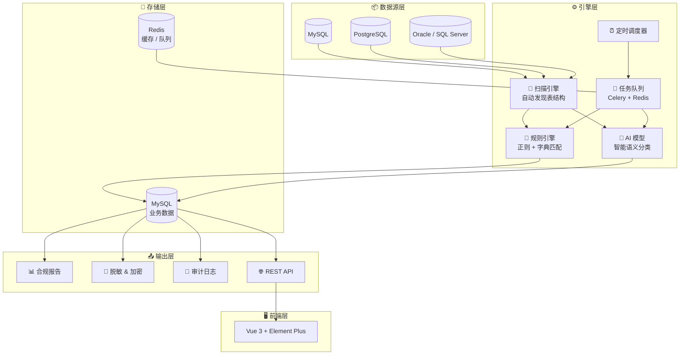
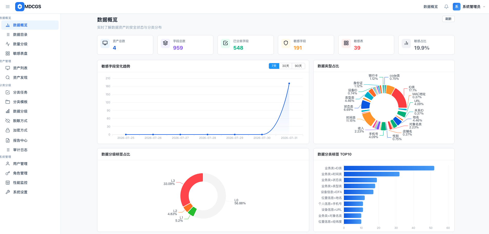
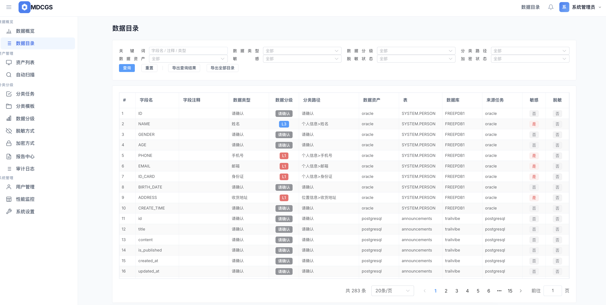
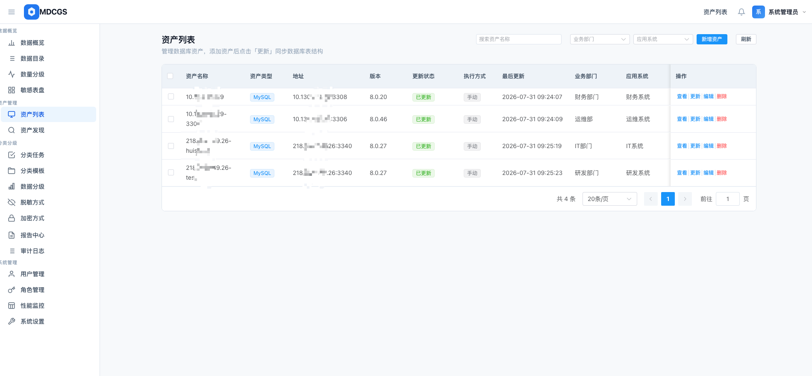
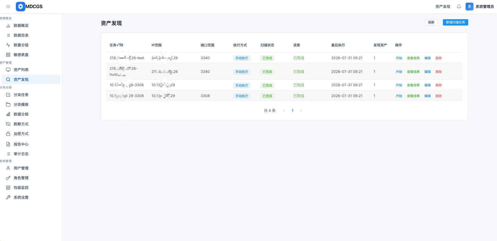
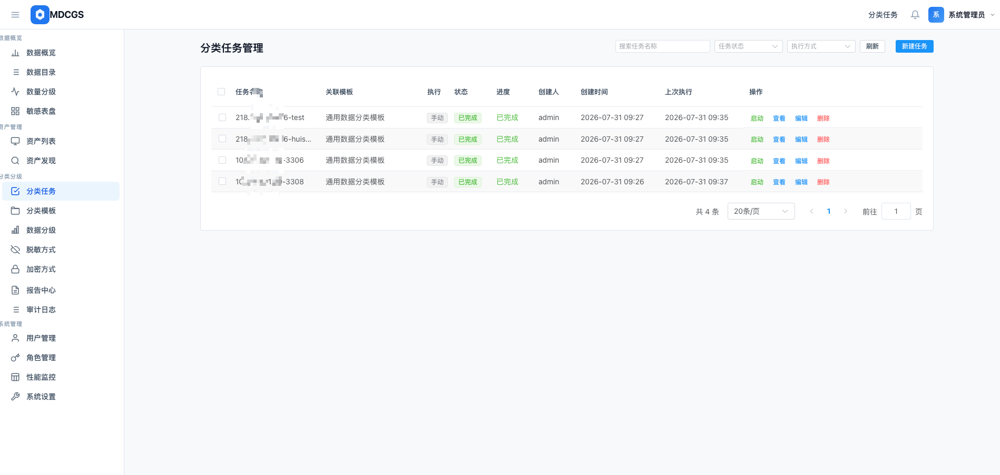
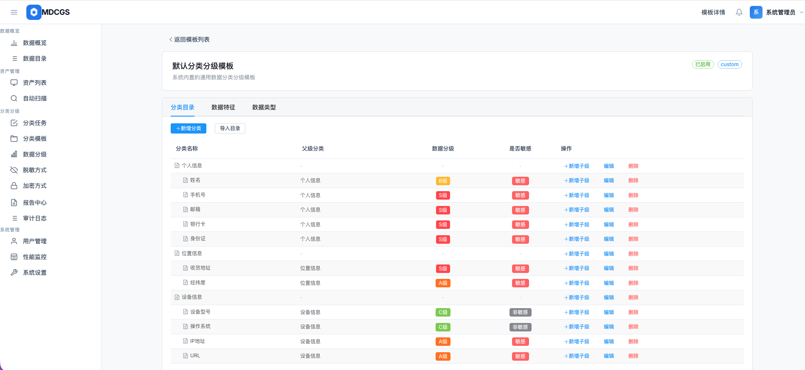
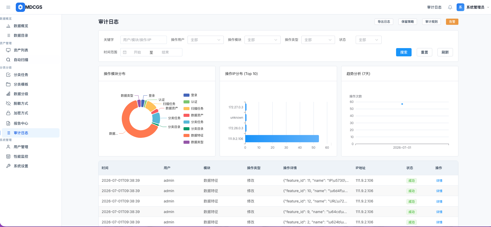
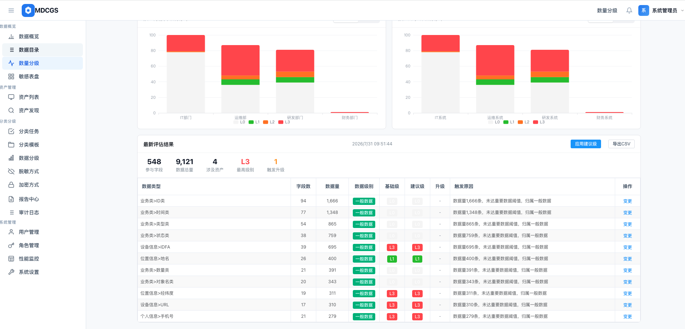

<p align="center">
  <h1 align="center">🛡️ MDCGS</h1>
  <p align="center"><b>数据分类分级管理系统</b></p>
  <p align="center">自动化识别敏感数据 · 精准定级 · 合规溯源</p>
</p>

<p align="center">
  <a href="https://github.com/HaoY-l/mdcgs/stargazers">
    
  </a>
  <a href="https://github.com/HaoY-l/mdcgs/blob/main/LICENSE">
    
  </a>
  
  
  
  
</p>

<p align="center">
  <b>🌐 官网</b>：<a href="https://hyinfo.cc">hyinfo.cc</a>　｜　<b>📺 在线演示</b>：<a href="https://mdcgs.hyinfo.cc/">mdcgs.hyinfo.cc</a>　｜　<b>账号</b>：admin　｜　<b>密码</b>：admin123
</p>

---

## 🚀 究竟是什么？

> **把杂乱无章的数据库字段，变成清晰可见的资产目录。**

MDCGS 是一款面向企业的**数据资产分类分级平台**，自动扫描数据库表结构，通过 **规则引擎 + AI 模型**双重识别身份证、手机号、银行卡等敏感字段，按行业模板自动分类分级，一键生成合规报告。

---

## 🧩 核心架构



### 技术栈

<p align="center">
  
  
  
  
  
  
  
  
</p>

---

## 📡 支持的数据源

| 类型 | 说明 |
|:---|:---|
| MySQL | 完整支持，自动扫描表结构与元数据 |
| PostgreSQL | 完整支持，自动扫描表结构与元数据 |
| Oracle | 完整支持，自动扫描表结构与元数据 |
| SQL Server | 完整支持，自动扫描表结构与元数据 |
| 达梦 DM | 国产信创数据库，完整支持 |
| OpenGauss | 暂未支持 |
| PolarDB | 暂未支持 |

---

## ✨ 核心能力

| 🕵️ **资产自动发现** | 🤖 **AI 智能分类** | 📊 **一键合规报告** |
|:---|:---|:---|
| 支持 MySQL / PostgreSQL等国产数据库 自动扫描表结构，告别手工台账 | 规则引擎 + 正则 + AI 模型三重识别，自动命中敏感字段 | 自动生成符合监管格式的数据资产报告，导出 PDF / Excel |

| 🎯 **多级分类分级** | 🔄 **批量任务执行** | 🔐 **分级授权管控** |
|:---|:---|:---|
| 内置可配置模板（个人信息 / 商业秘密 / 一般数据），支持自定义 | 全库万表批量分类，异步执行，进度实时可见 | 根据数据级别自动推荐脱敏规则、加密方式 |

| 📝 **全程操作审计** | 👥 **LDAP 自动同步** | ⏰ **定时增量扫描** |
|:---|:---|:---|
| 所有敏感操作留痕，谁在何时访问/修改了哪个字段，一目了然 | 对接企业现有账号体系，导入即用 | 字段变更自动触发分类复查提醒，结果不落后 |

---

## 🎯 解决的真实问题

<table>
<tr>
<td width="33%" align="center">
<b>😰 不知道敏感字段在哪</b><br/>
<br/>
<sub>几百个系统、数万张表，安全团队说不出"手机号字段都在哪"</sub>
<br/><br/>
<code>✅ 正则 + AI 双重识别，精准定位</code>
</td>
<td width="33%" align="center">
<b>🤷 权限靠人工判断</b><br/>
<br/>
<sub>某字段该不该让人导出？没有标准答案，看心情看关系</sub>
<br/><br/>
<code>✅ 数据分级 → 自动推荐访问权限</code>
</td>
<td width="33%" align="center">
<b>⏳ 变更后分类过期</b><br/>
<br/>
<sub>业务系统加了新字段，安全团队不知道，分类永远落后</sub>
<br/><br/>
<code>✅ 定时扫描 + 增量比对，自动触发</code>
</td>
</tr>
</table>

### 适用人群

<p align="center">
  <b>🔒 安全/合规团队</b> · <b>📊 数据治理团队</b> · <b>💻 IT/DBA 团队</b> · <b>⚖️ 法务/DPO</b>
</p>

---

## 📸 功能预览

<table>
<tr>
<td width="50%"><b>📊 总览仪表盘</b><br/><sub>资产总量、分类分布、敏感趋势，一张图搞定</sub><br/></td>
<td width="50%"><b>📂 数据目录</b><br/><sub>清晰展示数据资产树状结构</sub><br/></td>
</tr>
<tr>
<td width="50%"><b>📋 资产列表</b><br/><sub>多维筛选、编辑、导入导出</sub><br/></td>
<td width="50%"><b>🔍 资产自动扫描</b><br/><sub>自动发现数据库表结构</sub><br/></td>
</tr>
<tr>
<td width="50%"><b>📑 扫描任务</b><br/><sub>批量执行，进度实时跟踪</sub><br/></td>
<td width="50%"><b>🏷️ 分类模板</b><br/><sub>可视化配置分类分级体系</sub><br/></td>
</tr>
<tr>
<td width="50%"><b>📝 审计日志</b><br/><sub>所有操作可追溯</sub><br/></td>
<td width="50%"><b>📈 数量分级</b><br/><sub>敏感字段数据量是多少</sub><br/></td>
</tr>
</table>

---

## 🚀 快速开始

### 环境要求

| 依赖 | 版本 |
|:---|:---|
| Docker | ≥ 20.10 |
| Docker Compose | ≥ 2.0 |

### 1. 一键启动

```bash
git clone https://github.com/HaoY-l/mdcgs.git && cd mdcgs
```

```bash
# 复制配置
mv .env-example .env

# 启动服务
docker compose up -d
```

> 服务地址：**http://localhost:7785**　｜　默认账号：**admin / admin123**

### 2. 基础设施（如未准备好 MySQL / Redis）

<details>
<summary><b>📦 点击展开：快速创建 MySQL + Redis 容器</b></summary>

```bash
# MySQL
docker run -d --name mysql -p 3306:3306 \
  -e MYSQL_ROOT_PASSWORD=123456 \
  -e MYSQL_ROOT_HOST=% mysql

# 创建数据库
docker exec -it mysql mysql -uroot -p123456 \
  -e "CREATE DATABASE IF NOT EXISTS mdcgs DEFAULT CHARACTER SET utf8mb4 COLLATE utf8mb4_unicode_ci;"

# Redis
docker run -d --name redis -p 6379:6379 \
  --restart always redis:7-alpine \
  redis-server --requirepass "123456" --appendonly yes
```

</details>

<details>
<summary><b>⚙️ 点击展开：.env 配置参考</b></summary>

```bash
# MySQL
DB_HOST=<宿主机IP，不要127.0.0.1>
DB_PORT=3306
DB_USER=root
DB_PASSWORD=123456
DB_NAME=mdcgs
DATABASE_URL=mysql+pymysql://root:密码@宿主机IP:3306/mdcgs

# Redis
REDIS_URL=redis://宿主机IP:6379/0
REDIS_PASSWORD=123456
CELERY_BROKER_URL=redis://密码@宿主机IP:6379/1
CELERY_RESULT_BACKEND=redis://密码@宿主机IP:6379/2

# 安全（建议随机生成）
SECRET_KEY=your-random-secret-key
ENCRYPT_KEY=your-32-byte-encryption-key
```

</details>

<details>
<summary><b>🔧 点击展开：Docker 镜像加速</b></summary>

```bash
sudo mkdir -p /etc/docker && sudo tee /etc/docker/daemon.json <<EOF
{
  "registry-mirrors": [
    "https://docker.xuanyuan.me",
    "https://docker.1ms.run",
    "https://docker.m.daocloud.io",
    "https://docker.1panel.live",
    "https://docker.hlmirror.com",
    "https://hub.rat.dev",
    "https://docker.mirrors.ustc.edu.cn",
    "https://docker-0.unsee.tech"
  ]
}
EOF
sudo systemctl daemon-reload && sudo systemctl restart docker
```

</details>

---

## 📋 分类模板说明

MDCGS 内置了一套**通用分类分级模板**，同时也支持导入行业专属模板。

### 📂 模板目录

项目中的 [`TemplateExamples/`](TemplateExamples/) 目录存放了可直接导入的模板文件：

| 文件 | 说明 |
|:---|:---|
| [`通用模版.xlsx`](TemplateExamples/通用模版.xlsx) | 通用分类分级模板，开箱即用 |
| [`医疗行业模版.xlsx`](TemplateExamples/医疗行业模版.xlsx) | 医疗行业分类分级模板，开箱即用 |

### 📥 如何导入

1. 登录系统 → **分类模板** → **导入模板**
2. 选择 `TemplateExamples/` 下的 `.xlsx` 文件
3. 导入完成后即可关联资产、创建分类任务

### 🤝 如何贡献行业模板

欢迎贡献各行业的分类分级模板！

1. Fork 本仓库
2. 在 `TemplateExamples/` 目录下添加您的模板文件，命名格式：`<行业名>模版.xlsx`
3. 提交 Pull Request，附带模板说明（适用行业、分类体系、分级标准等）
4. 审核通过后合并，您的模板将出现在项目首页供大家使用

> 💡 **建议的模板格式**：可在系统内直接下载模版，按模版填充


---

## 📬 联系 & 贡献

<p align="center">
  <a href="https://github.com/HaoY-l/mdcgs/issues"></a>
  
</p>

---

<p align="center">
  <sub>Built with ❤️ by <a href="https://github.com/HaoY-l/mdcgs">MDCGS Team</a></sub><br/>
  <sub>如果这个项目对你有帮助，请给个 ⭐ Star 支持一下！</sub>
</p>